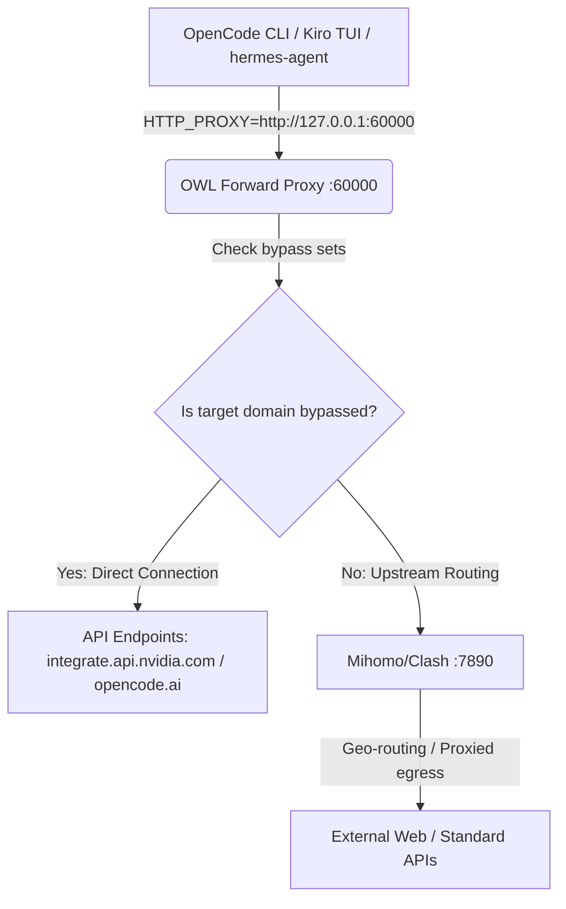

# 🦉 OWL-AGENT & OpenCode Proxy Architecture Design & Troubleshooting Guide

This document preserves the custom bypass routing design implemented to fix connection timeouts and SSL closed/dropped connection errors (`SSL_ERROR_SYSCALL` / `Connection closed unexpectedly`) in OpenCode Zen and NVIDIA model integration.

---

## 🏗️ 1. Proxy System Architecture Diagram



---

## ⚡ 2. Core Routing Mechanics & Bypass Implementation

To prevent upstream proxy loops and SSL handshake drops (where Mihomo's exit nodes get blocked or fail to resolve handshakes for core development and AI endpoints), the `owl-forward-proxy` intercepts all calls and forces a **direct-connect bypass** for high-priority domains.

### Bypassed Domains
The following domains are explicitly bypassed inside `/home/x1/.owl-agent/forward_proxy.py`:
1. `localhost`, `127.0.0.1`, `::1` (Loopback services)
2. `integrate.api.nvidia.com` & `*.nvidia.com` (NVIDIA NIM APIs / DeepSeek V4)
3. `opencode.ai` & `*.opencode.ai` (OpenCode Zen model endpoints)
4. `*.amazonaws.com` & `*.kiro.dev` (Kiro/AWS Q backend APIs — SSL_ERROR_SYSCALL without direct connect)

### Code Patches in `forward_proxy.py`

#### A. In TCP Tunneling (`connect_upstream`):
```python
    # Loopback and direct bypass destinations always connect directly — never route through upstream proxy
    _bypass = {"127.0.0.1", "::1", "localhost", "opencode.ai"}
    if host in _bypass or host.endswith(".nvidia.com") or host.endswith(".opencode.ai"):
        return await asyncio.wait_for(
            asyncio.open_connection(host, port),
            timeout=CONNECT_TIMEOUT,
        )
```

#### B. In HTTP Client Sessions (`handle_http`):
```python
        if parsed.scheme == "https":
            is_bypass = target_host in {"127.0.0.1", "::1", "localhost", "opencode.ai"} or target_host.endswith(".nvidia.com") or target_host.endswith(".opencode.ai")
            proxy_url = None if is_bypass else (UPSTREAM_PROXY or None)
```

---

## 🛠️ 3. Troubleshooting & Diagnostics

If `opencode` or `kiro-cli` throws a socket or connection error, follow this sequence:

### ① Run the Automated Diagnostic Tool
Execute the built-in troubleshooting script:
```bash
/home/x1/.owl-agent/diagnose_opencode.sh
```

This script will verify:
* Active listening ports for **OWL Proxy (`60000`)**, **9Router (`20128`)**, and **Mihomo (`7890`)**.
* Mount status of the terminal Unix domain socket.
* Network bypass connectivity directly to `nvidia.com` and `opencode.ai`.

### ② Resolve Unix Domain Socket Errors
If you see the error:
`No file at path: "/run/user/1000/kirorun/t/<session_id>.sock"`

**Resolution**:
1. Completely close all terminal windows or editor workspaces.
2. Open a new terminal window. This forces the `kiro-cli-term` shell hooks to mount a fresh Unix socket matching the active session environment.

### ③ Inspect Log Files
* **Forward Proxy Log**: `tail -n 50 ~/.owl-agent/logs/forward-proxy.log`
* **Kiro Core Logs**: `tail -n 50 /run/user/1000/kiro-log/kiro-chat.log`

---

## 🔒 4. Future-Proofing Guidelines for Incoming AIs
> [!IMPORTANT]
> When updating the proxy or installing extensions using scripts like `install_owl_agent.sh`:
> 1. **Do not overwrite `forward_proxy.py`** without preserving the direct-connection bypass rules for `*.nvidia.com` and `*.opencode.ai`. Overwriting this file breaks model loading.
> 2. **Maintain a minimal `NO_PROXY` block** (`localhost,127.0.0.1,.local,.localdomain,::1`) in `~/.bashrc` to ensure other systems don't leak external AI domain calls. Use proxy-level domain-bypassing instead.
